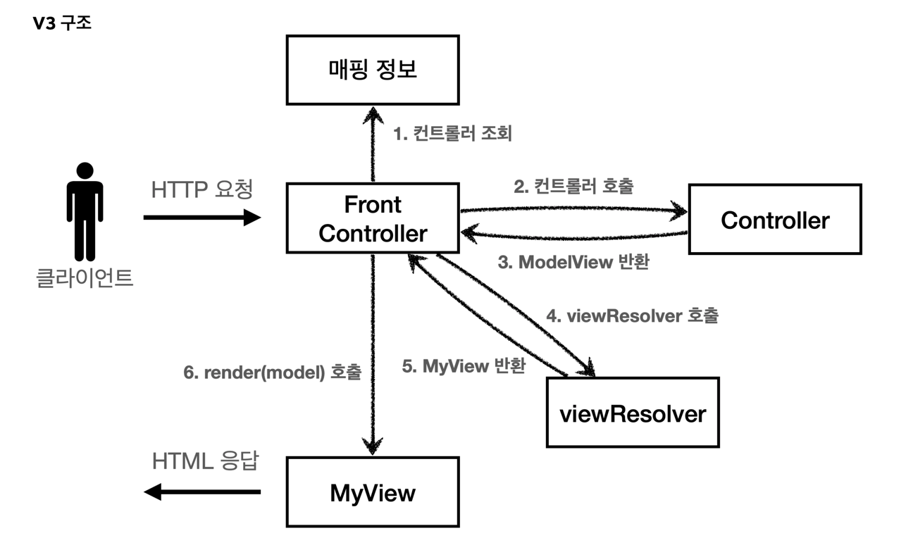

## V1에서 V3까지의 개선과정

### V1

- FrontController 패턴 적용
    - FrontController 서블릿 하나로 클라이언트의 요청 처리
    - FrontController 가 요청에 맞는 Controller 찾아서 호출
    - 공통 처리 가능
    - FrontController를 제외한 나머지 Controller들은 서블릿을 사용하지 않아도 된다.
- 스프링부트의 DispatcherServlet이 바로 FrontController 패턴

### V2

- MyView 생성
- request와 response를 이용하여 render 하는 중복 부분 제거

### V3

- ModelView 생성
- Controller에서 request와 response 종속성 제거 (서블릿 종속성 제거)
    - 이로써 테스트 코드 작성이 전보다 용이해졌다.
- 중복되는 prefix, suffix 제거 (prefix = `/WEB-INF/views/`, suffix = `.jsp`)